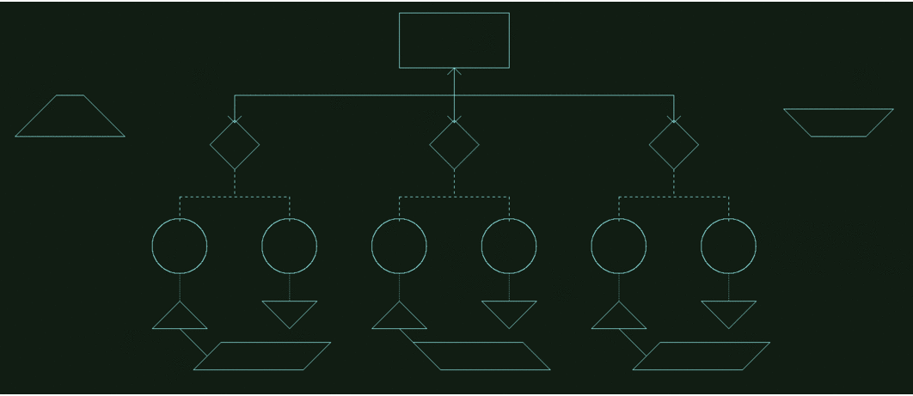

# EnhancedCanvas
A simple enough school project requiring that the final product displays a flowchart.
However, this repository contains the original code, but is revised as I play around with it, adding 
more features, and testing various techniques. This is merely supposed to be a practice field for my 
CSCI 338 [Software Engineering] class. There's a JAR file within the root folder of this repository called
 `drawings.jar` that is to be used with this specific project. 

## Required Tasks
- [x] Draw lines
    - [x] Draw dotted and dashed lines
    - [x] Draw arrows   
- [x] Draw rectangles (boxes)
- [x] Draw upwards and downwards triangles 
- [x] Draw circles
- [x] Draw parallelograms
- [x] Draw diamonds
- [x] Removal of shapes on display when clicked on

## Personal Additions
Other personal additions will be added as I think of other shapes that I'd like to draw.
- [x] Utilized the ability of adding and using Color within the display
- [x] Implement upward and downward facing trapezoids (some extra work required, however)
- [ ] Implement hexagons, both horizontal and vertical

## Showcase
